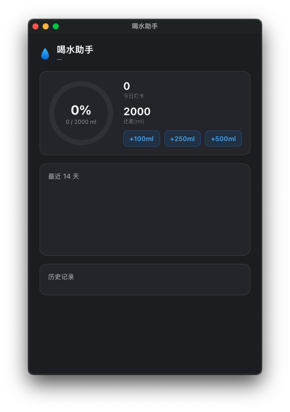

# 💧 WaterHelp — Drink Water Reminder

**[中文](./README.md) | [English](./README.en.md)**

A cross-platform (macOS / Windows) hydration reminder that lives in your menu bar / system tray: a droplet icon fills with blue as you drink throughout the day. When it's time, a native notification pops up — click **"Drank +250ml"** right on the notification to log it. Open the main window to browse history and charts.

Built with **Tauri 2** (Rust + plain web frontend) — one codebase for both platforms, no Node toolchain, ~14 MB.

  



## ✨ Features

- **Droplet progress icon** — the blue fill level inside the tray droplet shows today's intake ÷ goal at a glance; outline color adapts to light/dark mode automatically
- **One-tap logging from notifications** (macOS) — reminders come with **"Drank +250ml"** and **"Later"** buttons; tap once to log and restart the countdown without interrupting your work
- **Quick panel** — click the tray icon to open: progress ring, +100/+250/+500ml quick log, next-reminder countdown, 30/45/60 min interval, daily goal 1000–5000ml, 1-hour pause
- **Main window** — a regular app window (Dock/Launchpad visible) with today's overview, a 14-day bar chart, and a history list with goal-completion status; closing just hides it, reopen instantly from the Dock
- **Daily auto-reset at midnight**, history archived per day (90 days kept)
- **Launch at login** (optional) — starts silently in the tray
- **Local-only data** (a single JSON file), nothing is uploaded

## 📦 Install

Grab the latest build from [Releases](https://github.com/zlxconan/water-help/releases):

| File | Platform | How to install |
|---|---|---|
| `WaterHelp-macOS-universal.zip` | macOS 10.15+ (Universal: Intel + Apple Silicon) | Unzip, drag into **Applications** |
| `WaterHelp-Windows-x64.zip` | Windows 10/11 x64 | Unzip and run (portable; uses the built-in WebView2) |

> macOS Gatekeeper note: if the app can't be verified, right-click → Open, or allow it in System Settings → Privacy & Security.
> macOS notifications require **System Settings → Notifications → WaterHelp → Allow Notifications**.

## 🖥 Interface at a glance

| Where | What it does |
|---|---|
| Tray / menu bar icon | Droplet fill = today's progress; left-click for the quick panel, right-click for the menu |
| Quick panel | Log water, interval/goal settings, pause, launch-at-login, quit (auto-hides on focus loss) |
| Main window | Today's ring + quick log + 14-day chart + history list |
| Notifications | Timed reminders; on macOS you can log directly from the notification buttons |

See the UI design mockup at [docs/design.png](docs/design.png).

## 🔨 Build from source

```bash
# macOS (universal binary: x86_64 + arm64)
bash scripts/build-macos.sh          # produces dist/WaterHelp.app

# Windows
cd src-tauri && cargo build --release    # produces target/release/waterhelp.exe

# Or build in the cloud: push to GitHub and Actions produces both platforms automatically
```

The frontend is plain static HTML/CSS/JS (in `ui/`), embedded into the binary at compile time — **no Node.js required**.

## 🗂 Project layout

```
ui/                 Frontend (plain HTML/CSS/JS, no build step)
  index.html        Tray quick panel
  main.html         Main window (history & stats)
src-tauri/
  src/main.rs       Tray icon, window management, timer engine, Tauri commands
  src/state.rs      App state: logging/pause/day-rollover/history/JSON persistence
  src/droplet.rs    Renders the droplet progress icon at runtime (tiny-skia)
  src/notify.rs     Native notifications (macOS NSUserNotification / Windows Toast)
scripts/            macOS bundling script (shared by local builds and CI)
.github/workflows/  CI: builds macOS universal + Windows x64 in the cloud
docs/               Screenshots and design mockup
legacy/macos-swift/ Early pure-Swift native version (macOS only, kept for reference)
```

## ⚙️ Data location

- macOS: `~/Library/Application Support/com.waterhelp.desktop/state.json`
- Windows: `%APPDATA%\com.waterhelp.desktop\state.json`

To erase all data, just delete that file.

## 🧪 Development

```bash
cd src-tauri
cargo run                                   # debug run
WATERHELP_INTERVAL_SECS=8 cargo run         # 8-second interval to test the reminder loop quickly (debug builds only)
```

## 🗺 Roadmap

- [ ] Action buttons on Windows notifications (Toast XML / AppUserModelID registration)
- [ ] Light/dark adaptive tray icon on Windows
- [ ] Richer stats (streak days, weekly view)
- [ ] UI localization

## 🤝 Contributing

Issues and PRs are welcome! Make sure `cargo build` passes before submitting. UI changes only require editing the HTML/CSS/JS under `ui/` — no build tools involved.

## 📄 License

[MIT](./LICENSE) © WaterHelp Contributors
